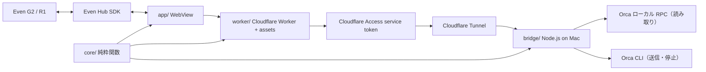

# 設計

G2 の画面に出すものと、入力で何が起きるかは、すべて `core/` の純粋関数で決まる。各実行環境（スマートフォン、Mac、Cloudflare）には、副作用を実行するだけの薄いアダプターを置く。

## 責務

| 場所            | 責務                                                                 | 副作用 |
| --------------- | -------------------------------------------------------------------- | ------ |
| `core/reader`   | `Model::update(Msg) -> Array[Effect]`。画面遷移、追従、世代管理     | なし   |
| `core/view`     | `Model::frame()`。G2 の 3 コンテナーの文字列                         | なし   |
| `core/text`     | 表示セル幅、折り返し、ページ分割、端末制御文字の除去                 | なし   |
| `core/orca`     | RPC フレーム・CLI の JSON・送信 receipt の解釈                       | なし   |
| `core/api`      | ルーティング、bearer の定数時間比較、本文の検証、CORS、WAV ヘッダー  | なし   |
| `core/relay`    | Worker が中継するか・何を返すかの判断                                | なし   |
| `app/`          | effect の実行（HTTP・タイマー・マイク）、G2 への直列書き込み         | あり   |
| `bridge/`       | HTTP サーバー、Orca の RPC / CLI、whisper.cpp、操作 ID の記録       | あり   |
| `worker/`       | assets 配信、Access 資格情報を付けた中継                             | あり   |
| `infra/`        | Worker・assets・secret binding・Tunnel・DNS・Access                  | Terraform |

FFI の境界では文字列・数値・真偽値・`Bytes`（Uint8Array）と不透明な host 値だけを受け渡し、JSON は MoonBit 側で解釈する。Node.js の組み込みモジュールは `process.getBuiltinModule` で取得するので、ブリッジはバンドラーなしで動く。Worker は MoonBit の main が `globalThis` に登録したハンドラーを、ビルド時に付け足す `export default` から呼ぶ。

## 閲覧の一貫性

- グラスの本文は 1 画面 4 行・42 セルに抑え、端末の空行と装飾用の罫線を省く。セッション一覧は 1 件 1 行にし、見出しには状態、下部にはページ位置や新着など必要な情報だけを出す。
- 出力は Orca が描画している画面（`terminal.read --screen`）を読む。取れないときは履歴に落とし、その旨を返す。エージェントの状態が読めなければ「状態不明」とし、成功を推測しない。
- ページは末尾基準で分割し、最新ページが常に埋まるようにする。上へ移動すると追従を止め、表示中のスナップショットを固定する。新着は別に保持し、「新着あり」と示す。
- セッションを切り替える・一覧へ戻る・録音を取り消すたびに世代を進め、古い世代の応答とタイマーを捨てる。ポーリングは応答を受けてから次を予約するので、同時に 1 本しか走らない。
- カーソルはセッション ID で保持し、一覧の並び替えでずれない。接続が切れたら見出しに示し、保存済みの出力を最新のように見せない。401 を受けたら設定画面へ戻る。

## 操作の配送

- 送信の前に毎回 `terminal.agentStatus` を確認し、エージェントが動いていない端末（素のシェル）には送らない。
- 指示は CLI の独立した引数として渡し、シェルを経由しない。`--wait-submit` の receipt を読み、「受け付けた」と「実行開始を観測した」を区別して表示する。停止は「停止の入力を送った」と表示し、止まったとは言わない。
- クライアントは操作ごとに新しい operation ID を付ける。ブリッジは同じ ID の処理中の要求を 409 で断り、完了した要求には同じ応答を返し、別内容での再利用を拒否する。CLI に渡す前に失敗した操作は記録しないので、同じ ID で再試行できる。記録はプロセス内・24 時間で、再起動をまたぐ保証はない。

## 接続とインフラ

- スマートフォンが持つのはペアリング用トークンだけ。URL の fragment で受け取り、読み取ったら履歴から消して localStorage に保存する。
- Worker は `/api/*` の既知のルートだけを、設定された `https://` のホスト名へ中継する。redirect は追わない（Access のログイン画面への redirect は設定不備として 502）。Access の service token は Terraform が Worker の secret binding に直接設定するので、人手で secret を扱わない。
- Tunnel は Mac の loopback のブリッジへだけ転送し、それ以外のホストは 404。Access は Worker の service token だけを通す。
- Terraform の state には Tunnel token と service token が入る。state は暗号化された private backend に置く。CI では mock provider の plan だけを実行し、実リソースは作らない。

## ビルド

- `nix/moonbit.nix` は MoonBit の公式バイナリを内容ハッシュで固定し、JS 用の標準ライブラリを bundle する。MoonBit は `latest` しか配布しないので、上流が更新されるとハッシュ不一致でビルドが止まる。`nix run .#update-moonbit` で固定し直す。
- Even Hub SDK は npm の tarball を integrity で検証して取り込み、`web/boot.js` が動的 import する。SDK がない・接続できない環境ではプレビューとして動く。

## 検証範囲

`moon test` はコアの状態遷移（古い応答の破棄、追従と一時停止、最終ページでの送信、停止の確認、録音の取り消し、401、接続切れ）、Orca 応答の解釈、ルーティング、認証、操作 ID、中継の判断を検証する。Terraform は mock plan で Access・Tunnel・secret binding の構成を検証する。実機 G2 のフォント・Bluetooth・Even App の挙動と、実際の Cloudflare への配置は自動テストの対象外。
