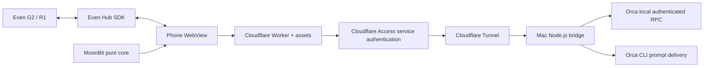

# 設計

進捗・返答の閲覧を主機能とする。操作はセッションを選択した後に行い、指示と停止は確認画面から明示的に実行する。

## 責務と境界

| 層                  | 責務                                                   | 副作用                          |
| ------------------- | ------------------------------------------------------ | ------------------------------- |
| `core/*.mbt`        | Unicode の折り返し、ページ分割、閲覧状態と入力遷移     | なし。入力から新しい値を返す    |
| `src/controller.ts` | polling、スナップショットの保持、core の effect の解釈 | HTTP / SDK を注入可能           |
| `src/even.ts`       | 576 × 288 のコンテナー、ジェスチャー、PCM キャプチャ   | 公式 SDK のみ                   |
| `server/orca.ts`    | セッション一覧・画面・状態、送信 receipt の解釈        | ローカル RPC / CLI              |
| `server/http.ts`    | bearer 認証、入力制限、操作 ID の重複抑制              | 限定した API のみ公開           |
| `worker/index.ts`   | assets 配信、固定した origin への API 中継             | Access 資格情報は server secret |
| `infra/*.tf`        | Tunnel、DNS、Access と service token                   | Terraform が管理                |
| `wrangler.jsonc`    | Worker コード、assets、bindings                        | Wrangler が管理                 |

MoonBit は JS backend の ESM にコンパイルする。FFI は JSON と文字列・整数・真偽値に限定し、コンパイラーの enum/struct 表現に依存しない。TypeScript 7 は薄いアダプターの型検証に使い、Mac の実行は Node.js の型除去だけで行う。自作 class は使わない。SDK のコンテナー型だけは公式コンストラクターで生成する。

## 閲覧の一貫性

出力は Orca の現在のターミナル画面を取得する。画面が取れない場合は履歴に fallback し、その事実を UI に表示する。状態が未知のときは「状態不明」とし、成功・完了を推測しない。polling と一覧の更新周期、応答サイズ、G2 のレイアウトは `shared/config.ts` にまとめる。

上・下のスワイプで追従を解除すると、その時点の出力を固定する。新しい出力は別スナップショットに保持し、追従を再開したときに切り替える。セッションを切り替えた後に古い HTTP 応答が到着しても、選択したセッションの ID を照合して破棄する。接続切れは明示し、保存済み出力を最新状態として見せない。

一覧が並び替わってもカーソル位置は session ID で維持する。指示の確認は複数ページに分割し、G2 の tap は最終ページに到達するまで送信しない。polling は単一 flight とし、破棄時に generation を進めて古い応答と次の timer 登録を無効にする。

## 操作の配送

API は毎回 `terminal.agentStatus` で実行中の agent を確認する。通常のシェルへの入力を拒否し、prompt は shell を経由せず CLI の独立した引数で渡す。`terminal send --enter --wait-submit` の durable receipt を読み、input acceptance と turn start の観測を区別する。Ctrl-C の送信は「停止入力を送った」と表示し、停止完了は断言しない。

同じ operation ID と payload の並行要求は一つの promise を共有する。失敗も保存して、自動再送しない。重複抑制はブリッジプロセス内・24 時間で、永続的な exactly-once 保証ではない。タイムアウト、プロセス再起動、曖昧な receipt の後は画面を確認してから新しい操作を選ぶ。

## 接続とインフラ

端末が持つのは user pairing token だけ。Worker は bearer を Mac に転送し、Worker の Access service token を別ヘッダーで付ける。Access の資格情報、Orca のローカル RPC authToken、Tunnel token は端末へ渡さない。Worker は設定された HTTPS origin と API allowlist にしか中継せず、redirect を追わない。

Web URL は same-origin で動作する。別 origin の package は `ALLOWED_ORIGINS` で明示し、認証ヘッダーの preflight を許可する。pack 時には public API origin のみを埋め込み、token を生成物に含めない。認証のない CORS 許可だけで操作権限を与えることはない。

Terraform と Wrangler の管理対象を分け、Worker 本体を Terraform で二重管理しない。Terraform の state に service secret が入るため、state は暗号化された private backend に保存する。本番 apply は CI の PR 検証では実行しない。検証は mock plan と schema validation のみ。

## 音声とライフサイクル

音声は任意機能。G2 の 16 kHz PCM16 mono を最大 60 秒取得して WAV にし、Mac の whisper.cpp で認識する。外部 STT への送信はない。recognition は prompt draft を作るだけで、送信は内容確認後の操作になる。録音終了・取消・ページ破棄時にマイクを閉じる。

## 互換性と検証範囲

初版は Orca の **ターミナル形式の agent session** を対象とする。ローカル RPC の read-only メソッドは Orca 1.4.206 で確認した内部インターフェースで、公開 SDK の安定保証はない。Orca の native chat、過去の閉じたセッション、質問・権限ダイアログへの回答は別アダプターが必要。未対応の状態を読み取れたことにしない。

CI は MoonBit の純粋関数、SDK の container validation、HTTP の認証と重複抑制、CLI adapter、Worker relay、閲覧競合を検証する。Playwright は接続設定・出力・確認・mobile のブラウザ動作を検証する。実際の G2 のフォント、Bluetooth、Even App の background behavior は実機で別途確認する。
